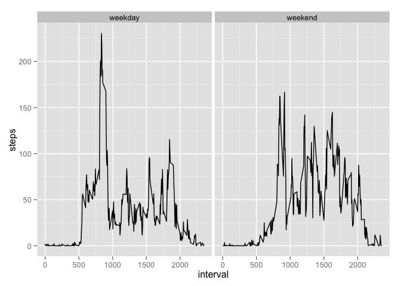

# Reproducible Research: Peer Assessment 1


## Loading and preprocessing the data
>Show any code that is needed to
>Load the data (i.e. read.csv())
>Process/transform the data (if necessary) into a format suitable for your analysis

Here I chose unz to read the zip file and then convert to date with as.Date.

```r
d <- read.csv(unz('activity.zip','activity.csv'));
d$date=as.Date(d$date);
```


## What is mean total number of steps taken per day?
>For this part of the assignment, you can ignore the missing values in the dataset.
>Make a histogram of the total number of steps taken each day
>Calculate and report the mean and median total number of steps taken per day


```r
ds<-aggregate(steps~date,d,sum);
hist(ds$steps,main='Steps taken per day before imputing');
```

 


```r
mean(ds$steps);
```

```
## [1] 10766
```


```r
median(ds$steps);
```

```
## [1] 10765
```

## What is the average daily activity pattern?
>Make a time series plot (i.e. type = "l") of the 5-minute interval (x-axis) and the average number of >steps taken, averaged across all days (y-axis)

Accomplished by aggregating steps per interval into dataset dt and plotting.

```r
dt<-aggregate(steps~interval,d,sum);
plot(dt,type="l");
```

 

>Which 5-minute interval, on average across all the days in the dataset, contains the maximum number of steps?


```r
dt[which.max(dt$steps),'interval'];
```

```
## [1] 835
```


## Imputing missing values
>Note that there are a number of days/intervals where there are missing values (coded as NA). The presence of missing days may introduce bias into some calculations or summaries of the data.
>
>Calculate and report the total number of missing values in the dataset (i.e. the total number of rows with NAs)

```r
sum(is.na(d$steps));
```

```
## [1] 2304
```


>Devise a strategy for filling in all of the missing values in the dataset. The strategy does not need to be sophisticated. For example, you could use the mean/median for that day, or the mean for that 5-minute interval, etc.
>
>Create a new dataset that is equal to the original dataset but with the missing data filled in.

The strategy I chose is to use the mean for each 5-minute interval. I calculate the means and then merge and fill the null values.

```r
da<-aggregate(steps~interval,d,mean);
names(da)[2] <- 'avgsteps'


d2 <- d;
d2<-merge(d2,da)
inull=is.na(d2$steps);
d2$steps[inull]<-d2$avgsteps[inull];
d2<-d2[,c('interval','steps','date')]
```


>Make a histogram of the total number of steps taken each day and Calculate and report the mean and median total number of steps taken per day. Do these values differ from the estimates from the first part of the assignment? What is the impact of imputing missing data on the estimates of the total daily number of steps?


```r
ds2<-aggregate(steps~date,d2,sum);
hist(ds2$steps, main="Steps taken per day after imputing");
```

 


```r
mean(ds2$steps);
```

```
## [1] 10766
```


```r
median(ds2$steps);
```

```
## [1] 10766
```

You can see the number of steps per day has gone up after imputing values.


## Are there differences in activity patterns between weekdays and weekends?
>For this part the weekdays() function may be of some help here. Use the dataset with the filled-in missing values for this part.
>
>Create a new factor variable in the dataset with two levels – “weekday” and “weekend” indicating whether a given date is a weekday or weekend day.
>
>Make a panel plot containing a time series plot (i.e. type = "l") of the 5-minute interval (x-axis) and the average number of steps taken, averaged across all weekday days or weekend days (y-axis). The plot should look something like the following, which was creating using simulated data:
>
>Your plot will look different from the one above because you will be using the activity monitor data. Note that the above plot was made using the lattice system but you can make the same version of the plot using any plotting system you choose.


```r
library('ggplot2')

d2$weekday = weekdays(d2$date);
d2$daytype = 'weekday' 
idx <- (d2$weekday=='Saturday') | (d2$weekday=='Sunday')
d2$daytype[idx] <- 'weekend'
d2$daytype <- as.factor(d2$daytype)
ggplot(d2,aes(x=interval, y=steps)) +stat_summary(fun.y="mean",geom='line')  +facet_grid(. ~ daytype)
```

 

The plot above shows a difference in steps by time period between weekdays and weekends.  We can see that the subject starts moving earlier on weekdays and has as strong spike in the morning that we do not see in the weekend.


